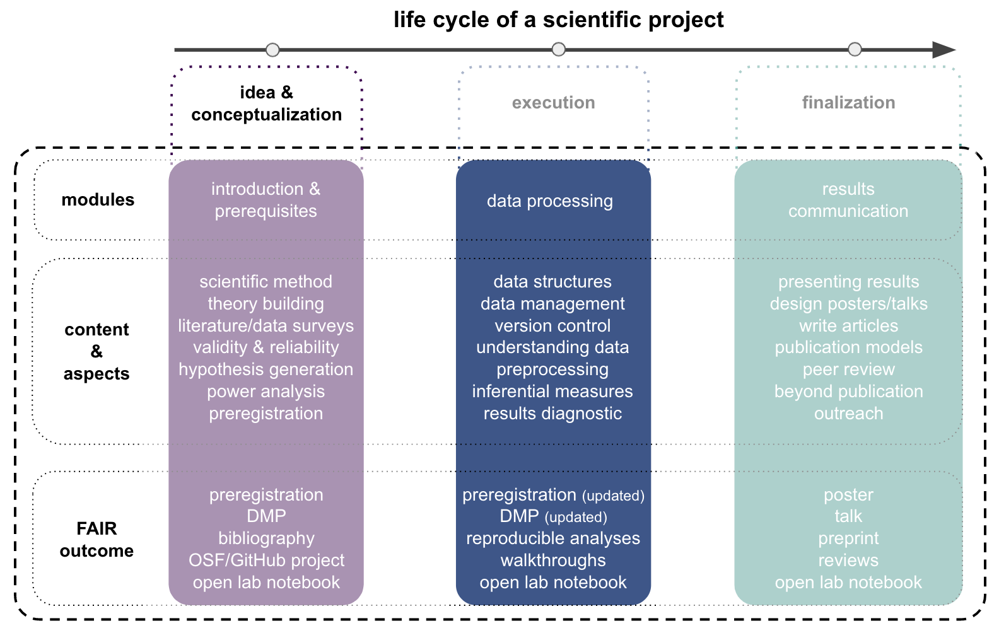

# Experimentation

### Schedule for this section

Please see below for our current _optimistic_ schedule. Depending on our progress, potential problems and different forms of learning, content and times might change a bit. Each lecture will be divided into several parts separated by a 5-10 minute break and might constitute a transition from basic to advanced concepts, theoretic to practical sessions and individual to group work. The different parts are roughly indicated in the schedule below like this:

🗓 - important information on date & time  
💡 - input from the instructor   
👨🏻‍🏫 - instructor presents content  
🥼 - research project work  
🧑🏽‍💻🧑🏾‍💻 - work on demo experiment  
🧑🏿‍🔬👩🏻‍🔬 - work on own research project  
🖥️ - computational work outside course hours  
✍🏽 - writing outside course hours  
📖 - reading outside course hours  

Please click on a given topic either within the table below or the `ToC` on the left to get to the respective materials.

| Date (day/month/year)  🗓   | Topics 💡👨🏻‍🏫    | Demo project related work 🥼🧑🏽‍💻🧑🏾‍💻  | Project related work 🥼🧑🏿‍🔬👩🏻‍🔬 | tasks for subsequent meeting 🖥️✍🏽📖 |
|--------------|-----------|------------|------------|------------|
| 17/11/2021 | Experimentation I - experimentation, inference & models  | not applicable | pre-registration, information/consent, data management plan | demo experiment report draft, materials for own project, reading [Makin & Orban de Xivry 2019](https://elifesciences.org/articles/48175) |
| 24/11/2021 | Experimentation II - no input from instructor  | not applicable | review & feedback for other groups' pre-registration, information/consent & data management plans, set up & test online experiment | incorporate feedback & prepare presentation of your own study, finalize demo experiment report |
| 01/12/2021 | Experimentation III - no input from instructor  | peer review of other groups' demo experiment report | presentation of your own study | work in reviews and finalize demo report, work in feedback for your own study  |
| 08/12/2021 | Experimentation IV - no input from instructor  | **deadline demo experiment report: 12 PM CET** | independent work on your project: recruitment, data collection, analyses drafting, report writing  | reading [The Book of Why, Ch. 1 & 4]() | 
| 15/12/2021 | Experimentation V - logic & causation, Game of academics  | not applicable | independent work on your project: recruitment, data collection, analyses drafting, report writing | independent work on projects, preparation of journal club |