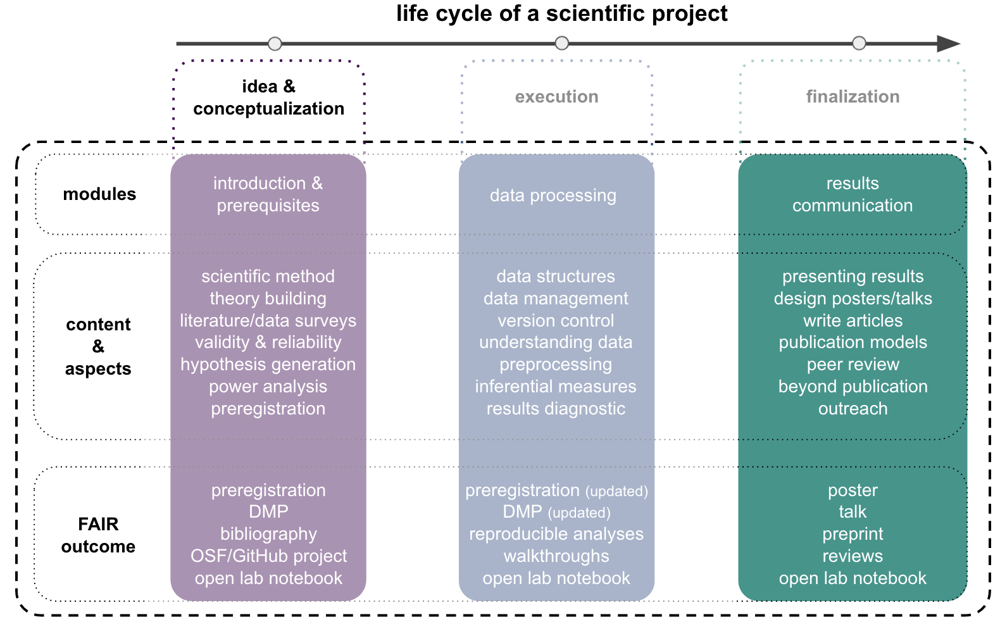

# Finalization - communication, documentation & outreach

### Schedule for this section

Please see below for our current _optimistic_ schedule. Depending on our progress, potential problems and different forms of learning, content and times might change a bit. Each lecture will be divided into several parts separated by a 5-10 minute break and might constitute a transition from basic to advanced concepts, theoretic to practical sessions and individual to group work. The different parts are roughly indicated in the schedule below like this:

🗓 - important information on date & time  
💡 - input from the instructor   
👨🏻‍🏫 - instructor presents content  
🥼 - research project work  
🧑🏽‍💻🧑🏾‍💻 - work on demo experiment  
🧑🏿‍🔬👩🏻‍🔬 - work on own research project  
🖥️ - computational work outside course hours  
✍🏽 - writing outside course hours  
📖 - reading outside course hours  

Please click on a given topic either within the table below or the `ToC` on the left to get to the respective materials.

| Date (day/month/year)  🗓   | Topics 💡👨🏻‍🏫    | Demo project related work 🥼🧑🏽‍💻🧑🏾‍💻  | Project related work 🥼🧑🏿‍🔬👩🏻‍🔬 | tasks for subsequent meeting 🖥️✍🏽📖 |
|--------------|-----------|------------|------------|------------|
| 12/01/2022 | Project finalization I - demo report feedback  | not applicable  | journal club I, independent work on your project: recruitment, data collection, analyses drafting, report writing | independent work on projects, reading [Rougier et al., 2014](https://www.ncbi.nlm.nih.gov/pmc/articles/PMC4161295/) |
| 19/01/2022 | Project finalization II - data visualization  | not applicable  | journal club II, independent work on your project: recruitment, data collection, analyses drafting, report writing | independent work on projects, reading [Erren & Bourne 2007](https://www.ncbi.nlm.nih.gov/pmc/articles/PMC1876493/), [Gundogan et al. 2016](https://www.sciencedirect.com/science/article/pii/S2049080116301303), [Scientific poster guide from UC Davis](https://urc.ucdavis.edu/sites/g/files/dgvnsk3561/files/local_resources/documents/pdf_documents/How_To_Make_an_Effective_Poster2.pdf), [Callie Chappell blog post](https://www.calliechappell.com/blog/scientific-poster), [NPR post on](https://www.npr.org/sections/health-shots/2019/06/11/729314248/to-save-the-science-poster-researchers-want-to-kill-it-and-start-over?t=1633527588204)|
| 26/01/2022 | Project finalization III - scientific posters  | not applicable  | independent work on your project: recruitment, data collection, analyses drafting, report writing | independent work on projects, poster draft |
| 02/02/2022 | Project finalization IV - no input from instructor | not applicable | independent work on your project: recruitment, data collection, analyses drafting, report writing -> **final analysis session** | independent work on projects, finalize poster |
| 09/02/2022 | Project finalization V - science outreach & staying in the loop, feedback & discussion, Q&A  | not applicable | poster presentations | **deadline reports: 23.02.2022 12 PM CET** |