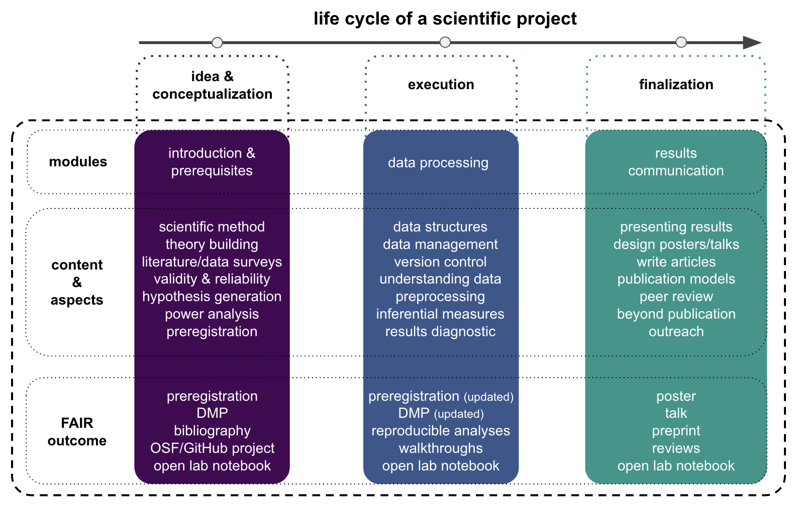

# General outline

Within the EXPRA, we will talk about and work through the core aspects of a scientific project, i.e. the `research workflow`, covering everything from `preparing a project and generating hypotheses` over `data acquisition and documentation` to `data analyzes and results communication`. These three defining parts will also be used as cornerstones of the course outline and will entail respective more-detailed subsections. The graphic below provides the respective outline.   

### When and where do we meet?

As mentioned in the [overview & procedure]() section, the course will take place weekly: every Wednesday from 8 AM - 12 PM CET at [PEG 5.G 129](https://qis.server.uni-frankfurt.de/qisserver/rds?state=verpublish&status=init&vmfile=no&moduleCall=webInfo&publishConfFile=webInfoRaum&publishSubDir=raum&keep=y&raum.rgid=7057), Theodor-W.-Adorno-Platz 6, 60323, Frankfurt am Main. 

<iframe width="425" height="350" frameborder="0" scrolling="no" marginheight="0" marginwidth="0" src="https://www.openstreetmap.org/export/embed.html?bbox=8.661464452743532%2C50.12589530933526%2C8.67423176765442%2C50.130778644149046&amp;layer=mapnik&amp;marker=50.12833703902714%2C8.667848110198975" style="border: 1px solid black"></iframe> <small><a href="https://www.openstreetmap.org/?mlat=50.12834&amp;mlon=8.66785#map=17/50.12834/8.66785">View Larger Map</a></small>

### Schedule

Please see below for our current _optimistic_ schedule. Depending on our progress, potential problems and different forms of learning, content and times might change a bit. Each lecture will be divided into several parts separated by a 5-10 minute break and might constitute a transition from basic to advanced concepts, theoretic to practical sessions and individual to group work. The different parts are roughly indicated in the schedule below like this:

🗓 - important information on date & time  
💡 - input from the instructor  
👨🏻‍🏫 - instructor presents content    
🥼 - research project work    
🧑🏽‍💻🧑🏾‍💻 - work on demo experiment    
🧑🏿‍🔬👩🏻‍🔬 - work on own research project    
🖥️ - computational work outside course hours    
✍🏽 - writing outside course hours    
📖 - reading outside course hours   

**Please note** that the course is scheduled to take place weekly in a 4 hour block, this will change substantially as the semester progresses and you will do more practical work acquiring and analyzing data, work on assignments and do group projects. Thus, some weeks we won't meet at all and some weeks for a certain amount of time. All of this will be communicated to you in a timely manner.  

**Please note** that there will be "winter holidays" from December 18th, 2021 - January 13th, 2022 and no classes will take place within this time period.  

| Date (day/month/year)  🗓   | Topics 💡👨🏻‍🏫    | Demo project related work 🥼🧑🏽‍💻🧑🏾‍💻  | Project related work 🥼🧑🏿‍🔬👩🏻‍🔬 | tasks for subsequent meeting 🖥️✍🏽📖 |
|--------------|-----------|------------|------------|------------|
| 20/10/2021 | Introduction I - [course information/overview/outline](https://peerherholz.github.io/EXPRA_Winter2021/introduction/introduction_1.html#course-overview-setup-outline) & [Knowledge generation](https://peerherholz.github.io/EXPRA_Winter2021/introduction/introduction_1.html#knowledge-generation)  | [take part in demo experiment](https://peerherholz.github.io/EXPRA_Winter2021/introduction/introduction_1.html#demo-project-related-work) |  not applicable   | [re-cap R lectures](https://pandar.netlify.app/lehre/), [install software](https://peerherholz.github.io/EXPRA_Winter2021/setup.html) |
| 27/10/2021 | Introduction II - [project & data management](https://peerherholz.github.io/EXPRA_Winter2021/introduction/introduction_2.html#project-data-management) & [information about demo experiment](https://peerherholz.github.io/EXPRA_Winter2021/introduction/introduction_2.html#information-about-the-demo-experiment)   | not applicable  |  not applicable | reading literature about [demo experiment](https://peerherholz.github.io/EXPRA_Winter2021/introduction/introduction_2.html#check-demo-experiment-literature)  | 
| 03/11/2021 | Introduction III - [preregistration](https://peerherholz.github.io/EXPRA_Winter2021/introduction/introduction_3.html#replicability-crisis-open-science-pre-registration) & [connecting the dots](https://peerherholz.github.io/EXPRA_Winter2021/introduction/introduction_3.html#a-brief-101-to-connect-the-dots)  | [OSF project, data management plan, preregistration, start writing report, data analyzes](https://peerherholz.github.io/EXPRA_Winter2021/introduction/introduction_3.html#demo-project-related-work) | not applicable | reading literature about [demo experiment](https://peerherholz.github.io/EXPRA_Winter2021/introduction/introduction_3.html#check-demo-experiment-literature) & check literature about concerning [scientific publications](https://peerherholz.github.io/EXPRA_Winter2021/introduction/introduction_3.html#check-literature-concerning-scientific-publications) (i.e. the `ten simple rules` papers) |
| 10/11/2021 | Introduction IV - [Scientific reading & writing I - finding/organizing & reading publications](https://peerherholz.github.io/EXPRA_Winter2021/introduction/introduction_4.html#scientific-reading-writing-i-finding-organizing-reading-publications)  | [finding/organizing & reading publications wrt the demo experiment](https://peerherholz.github.io/EXPRA_Winter2021/introduction/introduction_4.html#finding-organizing-reading-publications-wrt-the-demo-experiment) & [data analyzes](https://peerherholz.github.io/EXPRA_Winter2021/introduction/introduction_4.html#analyses-of-demo-experiment) | not applicable | [demo experiment report draft](https://peerherholz.github.io/EXPRA_Winter2021/introduction/introduction_4.html#demo-experiment) & check literature about concerning [scientific publications](https://peerherholz.github.io/EXPRA_Winter2021/introduction/introduction_4.html#check-literature-concerning-scientific-publications) | 
| 17/11/2021 |  Introduction V - [Scientific reading & writing II - structuring/writing publications](https://peerherholz.github.io/EXPRA_Winter2021/introduction/introduction_5.html#scientific-reading-writing-ii-structuring-writing-publications)  | [structuring demo experiment report](https://peerherholz.github.io/EXPRA_Winter2021/introduction/introduction_5.html#structuring-demo-experiment-report) & [data analyzes](https://peerherholz.github.io/EXPRA_Winter2021/introduction/introduction_5.html#analyses-of-demo-experiment) | not applicable | [demo experiment report draft](https://peerherholz.github.io/EXPRA_Winter2021/introduction/introduction_5.html#demo-experiment) & check literature about concerning [scientific publications](https://peerherholz.github.io/EXPRA_Winter2021/introduction/introduction_6.html#check-literature-concerning-scientific-publications) |
| 24/11/2021 | Introduction VI - [Scientific reading & writing III - reviewing publications](https://peerherholz.github.io/EXPRA_Winter2021/introduction/introduction_6.html#scientific-reading-writing-iii-reviewing-publications)  | [data analyzes](https://peerherholz.github.io/EXPRA_Winter2021/introduction/introduction_5.html#analyses-of-demo-experiment) | review & feedback for other groups' pre-registration, information/consent & data management plans, set up & test online experiment | [demo experiment report draft](https://peerherholz.github.io/EXPRA_Winter2021/introduction/introduction_5.html#demo-experiment) & check literature about concerning [scientific publications](https://peerherholz.github.io/EXPRA_Winter2021/introduction/introduction_6.html#check-literature-concerning-scientific-publications) |
| 01/12/2021 | Experimentation I - the demo experiment in more depth  | [data analyzes](https://peerherholz.github.io/EXPRA_Winter2021/introduction/introduction_5.html#analyses-of-demo-experiment) | drafting ideas for your own study | [demo experiment report draft](https://peerherholz.github.io/EXPRA_Winter2021/introduction/introduction_6.html#demo-experiment) |
| 08/12/2021 | Experimentation II - [experimentation, inference & models]()  | [write review for one other demo experiment group](https://peerherholz.github.io/EXPRA_Winter2021/experimentation/experimentation_1.html#demo-experiment-report-review) | pitching your own study | work in reviews and finalize demo report  |
| 15/12/2021 | Experimentation III - setting up your own experiment  | **deadline demo experiment report: 12 PM EST** | independent work on your project: recruitment, data collection, analyses drafting, report writing  | prepare presentation of your own study concerning motivation & background | 
| winter break | winter break | winter break | winter break | winter break |
| 12/01/2022 | Project finalization I - demo report feedback  | not applicable  | journal club I, independent work on your project: recruitment, data collection, analyses drafting, report writing | independent work on projects, reading [Rougier et al., 2014](https://www.ncbi.nlm.nih.gov/pmc/articles/PMC4161295/) |
| 19/01/2022 | Project finalization II - data visualization  | not applicable  | journal club II, independent work on your project: recruitment, data collection, analyses drafting, report writing | independent work on projects, reading [Erren & Bourne 2007](https://www.ncbi.nlm.nih.gov/pmc/articles/PMC1876493/), [Gundogan et al. 2016](https://www.sciencedirect.com/science/article/pii/S2049080116301303), [Scientific poster guide from UC Davis](https://urc.ucdavis.edu/sites/g/files/dgvnsk3561/files/local_resources/documents/pdf_documents/How_To_Make_an_Effective_Poster2.pdf), [Callie Chappell blog post](https://www.calliechappell.com/blog/scientific-poster), [NPR post on](https://www.npr.org/sections/health-shots/2019/06/11/729314248/to-save-the-science-poster-researchers-want-to-kill-it-and-start-over?t=1633527588204)|
| 26/01/2022 | Project finalization III - scientific posters  | not applicable  | independent work on your project: recruitment, data collection, analyses drafting, report writing | independent work on projects, poster draft |
| 02/02/2022 | Project finalization IV - no input from instructor | not applicable | independent work on your project: recruitment, data collection, analyses drafting, report writing -> **final analysis session** | independent work on projects, finalize poster |
| 09/02/2022 | Project finalization V - science outreach & staying in the loop, feedback & discussion, Q&A  | not applicable | poster presentations | **deadline reports: 23.02.2022 12 PM CET** |